# How to create an Ubuntu Desktop Yaru application with Flutter

This is a **beginner** tutorial for those new to the Dart programming language, new to programming languages in general and new to the Yaru design.

## Intro

The preinstalled applications on Ubuntu are quite diverse in their programming language and tooling origins. Some examples are the Firefox internet browser and the Thunderbird e-mail client both being C++ and JavaScript applications, the Libre-Office suite being written in C++, XML, and Java and gnome-files (A.K.A. nautilus) which is written in C with gtk.

Another toolkit is [Flutter](https://flutter.dev/). Flutter is a multi platform toolkit written in C++ and dart.
The GUI of the new Ubuntu Desktop installer is made Flutter as well as the next iteration of Ubuntu Software plus there are hundreds of iOS, Android, Windows, Web and MacOS applications created with Flutter.

Over the past years we've designed and developed several dart libraries which make it easy to create Ubuntu Desktop applications with Flutter. This tutorial will make all of this less mystical for people not familiar with neither Flutter nor our dart libraries.

### What you will learn

- How to setup your Flutter development environment on Ubuntu
- Learn VsCode basics
- Get to know dart libraries to create an aesthetic and visually consistent desktop application
- Get to know dart libraries to interact with existing Free-Desktop and hardware related APIs on Ubuntu
- Create a starting point for either a multi-page, single-page or wizard-like desktop applications on Ubuntu

### Skill requirements

It should be an advantage if you have created an application before, preferable with [an object oriented language](https://en.wikipedia.org/wiki/Object-oriented_programming) and if you are not scared to copy and paste commands into your terminal. But since this is a step-by-step, hands-on tutorial everyone with a bit of technical interest should do fine.

## Setup

### Install Flutter

If you want to create Android or Web applications with Flutter from your Ubuntu machine, all you need should be the flutter snap (`snap install flutter --classic`). However, this tutorial is about creating apps for the Ubuntu *Desktop*. Some of our dart libraries make use of native libraries which may not behave perfectly with the way the flutter snap interacts with your system.

The following lines will install the dependencies for Flutter Linux apps, create a directory in your home dir, clone the flutter git repository and export the `flutter` and `dart` commands to your path so you can run it from any user shell.

So please open up your terminal on Ubuntu by either pressing the key-combination CTRL + ALT + T or by searching for "Terminal" in your Ubuntu search. Now 

**either** copy & paste the following lines successively into your terminal and press enter after:

```bash
sudo apt install git curl cmake meson make clang libgtk-3-dev pkg-config
mkdir -p ~/development
cd ~/development
git clone https://github.com/flutter/flutter.git -b stable
echo 'export PATH="$PATH:$HOME/development/flutter/bin"' >> ~/.bashrc
source ~/.bashrc
```

**OR** use this one-liner to copy and paste everything into your terminal, :warning: this does not stop until it is done:

```bash
sudo apt -y install git curl cmake meson make clang libgtk-3-dev pkg-config && mkdir -p ~/development && cd ~/development && git clone https://github.com/flutter/flutter.git -b stable && echo 'export PATH="$PATH:$HOME/development/flutter/bin"' >> ~/.bashrc && source ~/.bashrc
```

### Install VsCode

Run the following command to install VsCode on your Ubuntu machine (or install it from Ubuntu Software):

```bash
sudo snap install code --classic
```

### Setup VsCode

Open VsCode, click on the extension icon in the left sidebar (1), type "Flutter" and click "Install" on the first entry (3), this should be the Flutter extension by Dart Code.


## Let's get started: flutter create

VsCode offers a command palette which you can open with either CTRL+SHIFT+P or by clicking on the :gear: icon 


We *could* now type "Flutter new project"

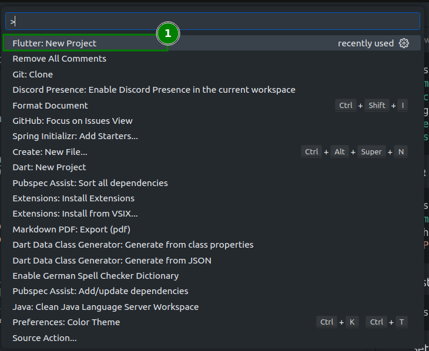

However, since we want to make amount of auto created files as small as possible to make the management as easy as possible, we want to specify the platforms for our new project.

Open the integrated terminal in vscode if it is not already opened


And run the following command to create a new Flutter project for Linux only (you can add more platforms at any point if you want) and specify the name of your organization/company and your appname:

```bash
flutter create --platforms=linux --org com.test my_yaru_app
```
Flutter created a small template app for us. Let's take a look at the three locations we need to visit first:

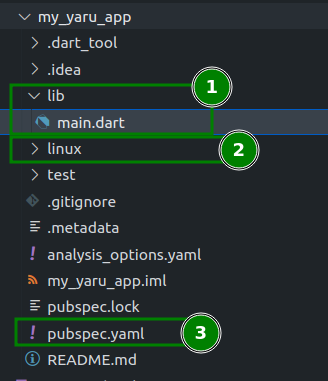

(1) Is the `lib` directory where all of our dart code lives. For now a single `main.dart` file should be enough. All platforms our app wants to be available for gets its own directory. In our case only the `Linux` directory (2). We will come this back later. To define metadata of our app and the dependencies we want to use we need the `pubspec.yaml` file (3).

### First run

Now click on `main.dart` (1) to open the file in your editor and click on the small `Run` label above the `void main()` declaration (2) to run the app for the first time


Caution, it is not pretty yet:

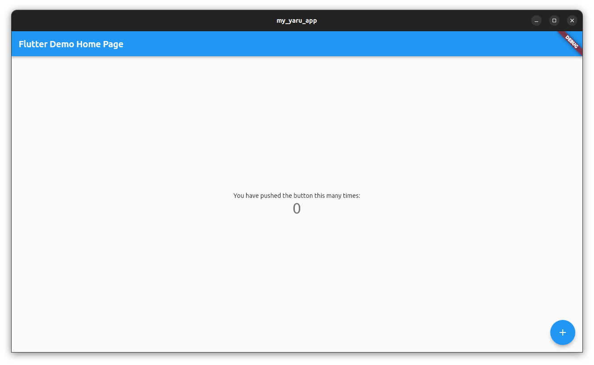

### Clean up

The Flutter template app is quite verbose explaining what it contains but we don't need most of the things in here for now. Delete everything in your main.dart file below line 5

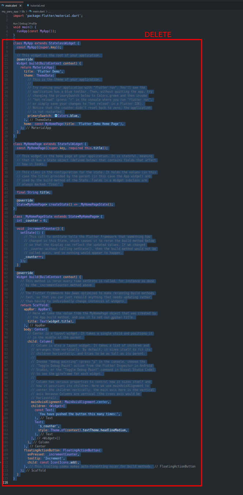

Dart will now complain that the class `MyApp` does not exist any longer. Because we've just deleted it on purpose.

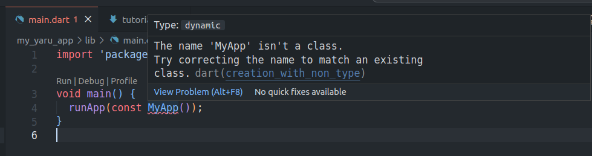

### First snipped: stle

The Flutter VsCode extensions is extremely helpful for almost any task and saves us a lot of lines to write. There are quick commands, snippets, auto-complete and auto fix features available which we will use in this tutorial.
The first help we will use is the snippet `stle` which is short for `StatelessWidget`.

Move below line 5 and write

`stle` 

Now a popup should ... pop-up. (if not press CTRL+ENTER, if this does not help either, there is something wrong with your setup of vscode, flutter and the Flutter VsCode extension).

(1) is your text and the cursor, (2) is the detected snippet `Flutter Stateless Widget` and (3) is a little explanation what will happen if you press ENTER now, which you please do now:


Something happened! Now please stay calm and look what you got. The created snippet left a multi-cursor in the places which change if you change the name of your `StatelessWidget`.


Just start writing now! Write `MyApp` and the text will be written into both places at once. When you are done press the ESC key on your keyboard to stop the multi-cursor. Pressing CTRL+S will save your code and the changes will be hot-reloaded immediately into your app:

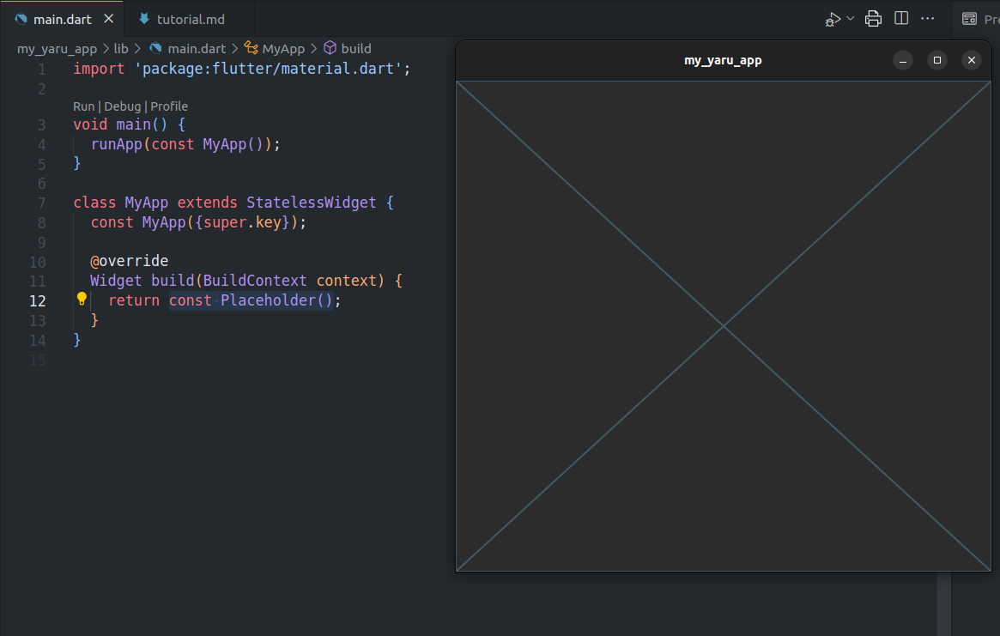

Every time you save your code by either pressing CTRL+S or by the menu entry File->Save, Flutter will [Hot-Reload your changes right into your dart process](https://docs.flutter.dev/development/tools/hot-reload). This means that you do not need to re-run your app every time you change something in your code. However if you exchange bigger parts you might need to click on Restart

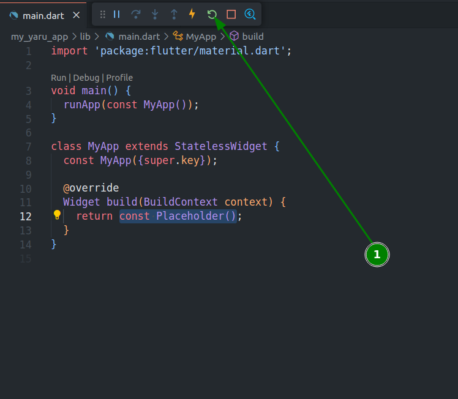

### First recap

(1) Imports the package `material.dart`

(2) Is the main application with the `runApp` [function call](https://dart.dev/language/functions).

(3) Is your [class](https://dart.dev/language/classes) `MyApp` which [extends](https://dart.dev/language/extend) the class [`StatelessWidget`](https://api.flutter.dev/flutter/widgets/StatelessWidget-class.html).
Extending this class forces your app to implement the [`Widget build(BuildContext context)`](https://api.flutter.dev/flutter/widgets/StatelessWidget/build.html) method, which you do by returning the Widget `PlaceHolder`.


### dart keywords used

- [import](https://dart.dev/language/libraries#using-libraries)
- [void](https://dart.dev/language/built-in-types)
- [const](https://dart.dev/language/variables#final-and-const)
- [class](https://dart.dev/language/classes)
- [extends](https://dart.dev/language/extend)
- [super](https://dart.dev/language/extend)
- [return](https://dart.dev/language/functions#return-values)


## Creating the app skeleton

### MaterialApp

Mark `const Placeholder`

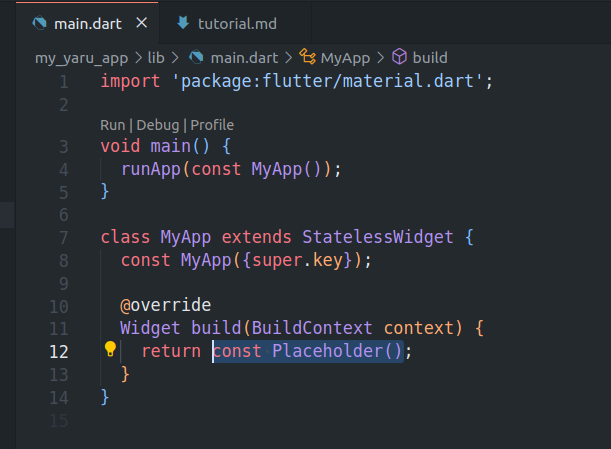

and write `MaterialApp` which opens a popup with a suggested class, press ENTER to replace `PlaceHolder` with `MaterialApp()`

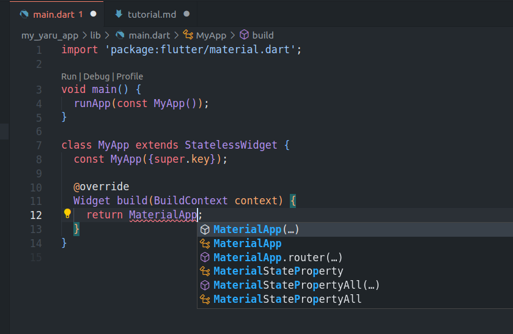

### Quick look into named parameters in dart

Don't code now, just read.

Functions in dart, as in any other modern programming language, can either have no or any kind and amount of [parameters](https://dart.dev/language/functions#parameters) (also called arguments or input variables). [*(In mathematics this is different. All functions must have at least one argument and a return value.)*](https://en.wikipedia.org/wiki/Function_(mathematics))

To make reading function calls easier dart has the optional feature of named [parameters](https://dart.dev/language/functions#parameters). Where a function, if defined with (a) named parameter(s), must be called by naming the parameter, followed by a `:` and the value that should be set.

Example definition without a named parameter:
```dart
int incrementByOne(int myParameter) {
    return myParameter + 1;
}
```

Calling the function:
```dart
incrementByOne(3);
```

Example definition with a named parameter:
```dart
int incrementByOne({required int myParameter}) {
    return myParameter + 1;
}
```

Calling the function:
```dart
incrementByOne(myParameter: 3);
```

To create an instance of a class one needs to call the [constructor](https://dart.dev/language/constructors) "function" (called method if part of a class).

Flutter widget classes almost always use named parameters, which is increasingly useful the more parameters a Widget has when you call its constructor method.

Example Widget definition:

```dart
class _MyNumberWidget extends StatelessWidget {
  // This is the constructor definition
  const _MyNumberWidget({required this.number});
  // This is your parameter of the type integer.
  final int number;

  @override
  Widget build(BuildContext context) {
    // using the parameter to be shown inside the UI
    return Text(number.toString());
  }
}
```

Somewhere else (where calling functions is allowed):
```dart
final Widget myNumberWidget = MyNumberWidget(number: 3)
```

#### New keywords learned

- [final](https://dart.dev/language/variables#final-and-const)
- [required](https://dart.dev/language/functions#named-parameters)

### Back to coding: Scaffold

Move your cursor inside the brackets of the `MaterialApp()` constructor call and insert

```dart
home:
```

VsCode then suggests:


Press enter, and write `Scaffold()`

VsCode then suggests:


Move the selection to `Scaffold()` by pressing your arrow-down key on your keyboard. Press enter when `Scaffold()` is selected.

Your code should now look like this:

```dart
import 'package:flutter/material.dart';

void main() {
  runApp(const MyApp());
}

class MyApp extends StatelessWidget {
  const MyApp({super.key});

  @override
  Widget build(BuildContext context) {
    return MaterialApp(home: Scaffold());
  }
}
```

*Note: it is always better to let VsCode do the work by only typing until the code-completion (they call it "intellisense") popup shows up with suggestions. Pressing enter while one of the suggestions is selected is always safer because you will avoid typing errors and because VsCode will often also make the necessary import for you, too. However to not make this tutorial unnecessarily long, we won't go through this in every step.*


## Using the Yaru libraries
### pub.dev

Pub.dev is the server infrastructure by google to host dart and flutter packages and you can use inside your flutter or dart applications by adding them as dependencies to your pubspec.yaml file.

Not all packages on pub.dev are made for Linux but many. You can filter them with the platform=Linux filter. Recommended is also to check the dart3 compatible checkbox to get up to date packages.

https://pub.dev/packages?q=platform%3Alinux+is%3Adart3-compatible

### Dart: add dependencies

From your development environment, in case of this tutorial VsCode, you can add, update and remove dependencies with the [`dart pub`](https://dart.dev/tools/pub/cmd) and `flutter pub` commands from the terminal.
In VsCode you can also use the command palette that you can open with CTRL+SHIFT+P.

Open the command palette and type `Dart: Add Dependency`


### Yaru.dart

Type `yaru` and select the `yaru` package by pressing enter. The package will now be added to your `pubspec.yaml` file.


Notice that two tasks are now run by VsCode. Wait until they are done


### YaruTheme

Move your cursor into `MaterialApp`


Press the new key-combination CTRL+., which will open up a new context menu "Quick fix" and move your selection to "Wrap with Builder"


Press Enter, and immediately press CTRL+S after, to safe your changes.

Saving your file also let's the VsCode flutter extension magically format your code in the background
with the [`dart format`](https://dart.dev/tools/dart-format) command.

Your resulting main.dart should now look like this:

```dart
import 'package:flutter/material.dart';

void main() {
  runApp(const MyApp());
}

class MyApp extends StatelessWidget {
  const MyApp({super.key});

  @override
  Widget build(BuildContext context) {
    return Builder(builder: (context) {
      return MaterialApp(home: Scaffold());
    });
  }
}
```

Replace `Builder` with `YaruTheme`. A auto-complete context menu will pop up.

- (1) Is what you write: `YaruTheme`
- (2) Is your selection after pressing enter
- (3) Is what will happen after you've pressed enter

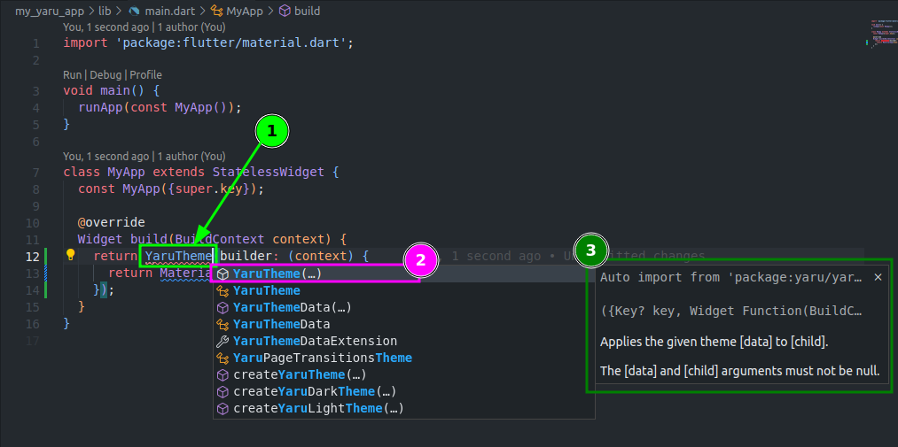

The `yaru.dart` package is now useable from within your `main.dart` file because the `import 'package:yaru/yaru.dart';` has been added (1) at the top of your file


The builder callback from `YaruTheme` needs two more parameters: an parameter of the type `YaruThemeData` and of the type `Widget?`.


Add them separated by `,`behind the `context` parameter of the `builder` callback of `YaruTheme` by writing `yaru, child`. Your code should now look like this:


```dart
import 'package:flutter/material.dart';
import 'package:yaru/yaru.dart';

void main() {
  runApp(const MyApp());
}

class MyApp extends StatelessWidget {
  const MyApp({super.key});

  @override
  Widget build(BuildContext context) {
    return YaruTheme(builder: (context, yaru, child) {
      return MaterialApp(home: Scaffold());
    });
  }
}
``` 

`yaru` can now be used as a parameter of `MaterialApp`, and the flutter app will switch it's accent colors according to what accent color is selected in your Ubuntu settings app.

Set the theme property of Material app to `yaru.theme`and the dark theme property to `yaru.darkTheme`:

```dart
import 'package:flutter/material.dart';
import 'package:yaru/yaru.dart';

void main() {
  runApp(const MyApp());
}

class MyApp extends StatelessWidget {
  const MyApp({super.key});

  @override
  Widget build(BuildContext context) {
    return YaruTheme(builder: (context, yaru, child) {
      return MaterialApp(
        theme: yaru.theme, // <-----------
        darkTheme: yaru.darkTheme, // <-------------
        home: Scaffold(),
      );
    });
  }
}
```

As an evidence that your app's accent color and brightness now follow your system let's add a primary color text in the middle of your `Scaffold`. 

- Set the `body` property of `Scaffold` to `Center()`
- Set the child property of `Center` to `Text('Hello Ubuntu')`
- Set the `style` property of the `Text` to `TextStyle(color: Theme.of(context).primaryColor)`

Your code should now look like this, but we ain't done yet:

```dart
import 'package:flutter/material.dart';
import 'package:yaru/yaru.dart';

void main() {
  runApp(const MyApp());
}

class MyApp extends StatelessWidget {
  const MyApp({super.key});

  @override
  Widget build(BuildContext context) {
    return YaruTheme(builder: (context, yaru, child) {
      return MaterialApp(
        theme: yaru.theme,
        darkTheme: yaru.darkTheme,
        home: Scaffold(
          body: Center(
            child: Text(
              'Hello Ubuntu',
              style: TextStyle(
                color: Theme.of(context).primaryColor,
              ),
            ),
          ),
        ),
      );
    });
  }
}
```

Move your cursor onto `Scaffold` and re-open the quick-fix context menu as before with CTRL+.
This time, select `Extract Widget` 


and press enter.

Look to the top, a little dialog appeared and asks you how the extracted Widget should be named.
Call it `_Home` (with a leading underscore):

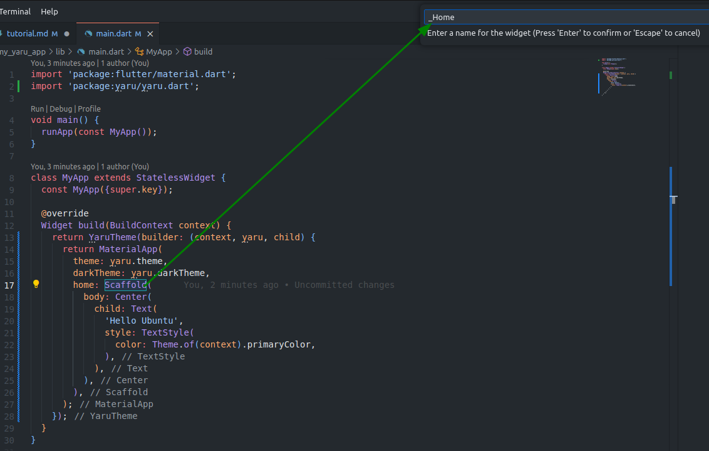

Press enter.

Your code should now look like this:

```dart
import 'package:flutter/material.dart';
import 'package:yaru/yaru.dart';

void main() {
  runApp(const MyApp());
}

class MyApp extends StatelessWidget {
  const MyApp({super.key});

  @override
  Widget build(BuildContext context) {
    return YaruTheme(builder: (context, yaru, child) {
      return MaterialApp(
        theme: yaru.theme,
        darkTheme: yaru.darkTheme,
        home: _Home(),
      );
    });
  }
}

class _Home extends StatelessWidget {
  const _Home({
    super.key,
  });

  @override
  Widget build(BuildContext context) {
    return Scaffold(
      body: Center(
        child: Text(
          'Hello Ubuntu',
          style: TextStyle(
            color: Theme.of(context).primaryColor,
          ),
        ),
      ),
    );
  }
}
```

Save your file and notice how the text is now colored in your system's primary accent color, while the window follows your system dark/light theme preference:


### Recap

Alright, take a deep breath! 

The basic yaru theme and colors are in but we got more things to do:

1) **Make the window consist of 100% flutter widgets with client side window decorations** <-- next
2) use yaru_icons
3) Make the window have 4 founded corners

### yaru_widgets.dart

As you may have observed the app is living inside a GTK window.


This is totally fine as it is because it works. However we aim to have the best look as possible, so we will need to use another yaru library: `yaru_widgets.dart`

Fire up the VsCode command palette again with CTRL+SHIFT+P, and type `Dart: Add Dependency` as before. Now search for `yaru_widgets` and hit enter when selected.

In your main.dart file write `YaruWindowTitleBar` before you call `runApp`.
- (1) write `YaruWindowTitleBar`
- (2) Notice the auto complete context menu
- (3) Notice the nice explanation about what will be imported (eventually even read it) and press enter


In line 3 you should now have this import
```dart
import 'package:yaru_widgets/yaru_widgets.dart';
```

Complete the line by using the `await` keyword, and calling `YaruWindowTitleBar.ensureInitialized()`

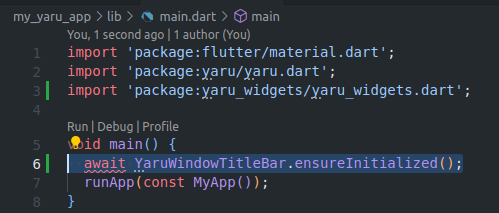

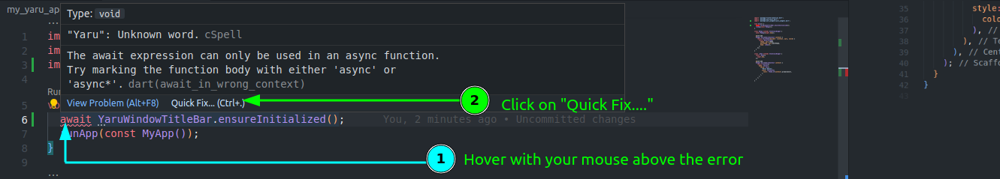

Use the recommended quick fix by pressing enter when "Add 'async' modifier" is selected


Your `main` function should now look like this:

```dart
Future<void> main() async {
  await YaruWindowTitleBar.ensureInitialized();
  runApp(const MyApp());
}
```

- Inside your `_Home` change the `appBar` property of `Scaffold` to `YaruWindowTitleBar()`
- Inside your `MyApp` change the `debugShowCheckedModeBanner` property to have the value `false` to remove the red debug banner in the window corner

Your code should now look like this:

```dart
import 'package:flutter/material.dart';
import 'package:yaru/yaru.dart';
import 'package:yaru_widgets/yaru_widgets.dart';

Future<void> main() async {
  await YaruWindowTitleBar.ensureInitialized();
  runApp(const MyApp());
}

class MyApp extends StatelessWidget {
  const MyApp({super.key});

  @override
  Widget build(BuildContext context) {
    return YaruTheme(builder: (context, yaru, child) {
      return MaterialApp(
        debugShowCheckedModeBanner: false,
        theme: yaru.theme,
        darkTheme: yaru.darkTheme,
        home: _Home(),
      );
    });
  }
}

class _Home extends StatelessWidget {
  const _Home({
    super.key,
  });

  @override
  Widget build(BuildContext context) {
    return Scaffold(
      appBar: YaruWindowTitleBar(),
      body: Center(
        child: Text(
          'Hello Ubuntu',
          style: TextStyle(
            color: Theme.of(context).primaryColor,
          ),
        ),
      ),
    );
  }
}
```

Since yaru_widgets also modified the Linux specific files we did not look into (yet) you need to restart the app this time completely. Stop it, and start it again.

Your app should now look like this (yes no round corners yet!):

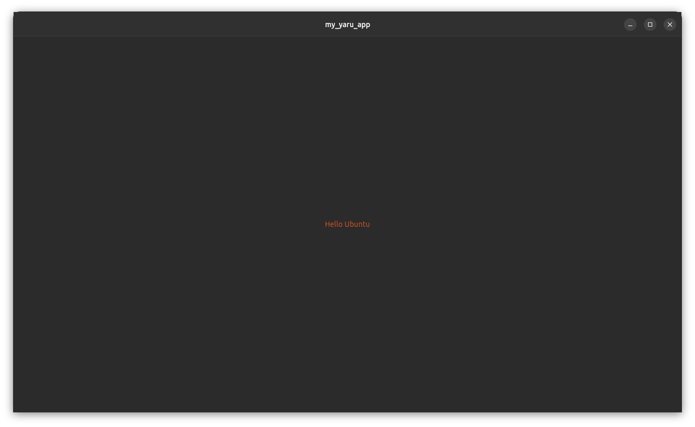

### handy_window.dart

It's getting the first time a little bit complicated. Please do not panic. Everything is described step by step!

Now we will need to modify two files inside the Linux directory to get the full `Yaru` look.
We could totally only change the lines that need to be changed, however this would expand this tutorial to c++ and cmake knowledge. So instead of editing the files, we will replace them completely.

- add `handy_window` like you've added the other dependencies before
- open `my_application.cc` inside the `Linux` directory
- Exchange the whole file with the following

```cc
#include "my_application.h"

#include <flutter_linux/flutter_linux.h>
#ifdef GDK_WINDOWING_X11
#include <gdk/gdkx.h>
#endif

#include <handy.h>

#include "flutter/generated_plugin_registrant.h"

struct _MyApplication {
  GtkApplication parent_instance;
  char** dart_entrypoint_arguments;
};

G_DEFINE_TYPE(MyApplication, my_application, GTK_TYPE_APPLICATION)

// Implements GApplication::activate.
static void my_application_activate(GApplication* application) {
  MyApplication* self = MY_APPLICATION(application);

#ifdef NDEBUG
  // Activate an existing app instance if already running but only in
  // production/release mode. Allow multiple instances in debug mode for
  // easier debugging and testing.
  GList* windows = gtk_application_get_windows(GTK_APPLICATION(application));
  if (windows) {
    gtk_window_present(GTK_WINDOW(windows->data));
    return;
  }
#endif

  GtkWindow* window = GTK_WINDOW(hdy_application_window_new());
  gtk_window_set_application(window, GTK_APPLICATION(application));

  GdkGeometry geometry_min;
  geometry_min.min_width = 680;
  geometry_min.min_height = 600;
  gtk_window_set_geometry_hints(window, nullptr, &geometry_min, GDK_HINT_MIN_SIZE);

  gtk_window_set_default_size(window, 1280, 720);
  gtk_widget_show(GTK_WIDGET(window));

  g_autoptr(FlDartProject) project = fl_dart_project_new();
  fl_dart_project_set_dart_entrypoint_arguments(project, self->dart_entrypoint_arguments);

  FlView* view = fl_view_new(project);
  gtk_widget_show(GTK_WIDGET(view));
  gtk_container_add(GTK_CONTAINER(window), GTK_WIDGET(view));

  fl_register_plugins(FL_PLUGIN_REGISTRY(view));

  gtk_widget_grab_focus(GTK_WIDGET(view));
}

static gint my_application_command_line(GApplication *application, GApplicationCommandLine *command_line) {
  MyApplication *self = MY_APPLICATION(application);
  gchar **arguments = g_application_command_line_get_arguments(command_line, nullptr);
  self->dart_entrypoint_arguments = g_strdupv(arguments + 1);

  g_autoptr(GError) error = nullptr;
  if (!g_application_register(application, nullptr, &error)) {
    g_warning("Failed to register: %s", error->message);
    return 1;
  }

  hdy_init();

  g_application_activate(application);
  return 0;
}

// Implements GObject::dispose.
static void my_application_dispose(GObject *object) {
  MyApplication* self = MY_APPLICATION(object);
  g_clear_pointer(&self->dart_entrypoint_arguments, g_strfreev);
  G_OBJECT_CLASS(my_application_parent_class)->dispose(object);
}

static void my_application_class_init(MyApplicationClass* klass) {
  G_APPLICATION_CLASS(klass)->activate = my_application_activate;
  G_APPLICATION_CLASS(klass)->command_line = my_application_command_line;
  G_OBJECT_CLASS(klass)->dispose = my_application_dispose;
}

static void my_application_init(MyApplication* self) {}

MyApplication* my_application_new() {
  return MY_APPLICATION(g_object_new(
      my_application_get_type(), "application-id", APPLICATION_ID, "flags",
      G_APPLICATION_HANDLES_COMMAND_LINE | G_APPLICATION_HANDLES_OPEN,
      nullptr));
}
```

- open `CMakeLists.txt`
- replace the whole file with the following file (make sure that BINARY_NAME and APPLICATION_ID match your app)

```cmake
cmake_minimum_required(VERSION 3.10)
project(runner LANGUAGES CXX)

set(BINARY_NAME "my_yaru_app")
set(APPLICATION_ID "com.test.my_yaru_app")

cmake_policy(SET CMP0063 NEW)

set(USE_LIBHANDY ON)

set(CMAKE_INSTALL_RPATH "$ORIGIN/lib")

# Configure build options.
if(NOT CMAKE_BUILD_TYPE AND NOT CMAKE_CONFIGURATION_TYPES)
  set(CMAKE_BUILD_TYPE "Debug" CACHE
    STRING "Flutter build mode" FORCE)
  set_property(CACHE CMAKE_BUILD_TYPE PROPERTY STRINGS
    "Debug" "Profile" "Release")
endif()

# Compilation settings that should be applied to most targets.
function(APPLY_STANDARD_SETTINGS TARGET)
  target_compile_features(${TARGET} PUBLIC cxx_std_14)
  target_compile_options(${TARGET} PRIVATE -Wall -Werror)
  target_compile_options(${TARGET} PRIVATE "$<$<NOT:$<CONFIG:Debug>>:-O3>")
  target_compile_definitions(${TARGET} PRIVATE "$<$<NOT:$<CONFIG:Debug>>:NDEBUG>")
endfunction()

set(FLUTTER_MANAGED_DIR "${CMAKE_CURRENT_SOURCE_DIR}/flutter")

# Flutter library and tool build rules.
add_subdirectory(${FLUTTER_MANAGED_DIR})

# System-level dependencies.
find_package(PkgConfig REQUIRED)
pkg_check_modules(GTK REQUIRED IMPORTED_TARGET gtk+-3.0)

add_definitions(-DAPPLICATION_ID="${APPLICATION_ID}")

# Application build
add_executable(${BINARY_NAME}
  "main.cc"
  "my_application.cc"
  "${FLUTTER_MANAGED_DIR}/generated_plugin_registrant.cc"
)
apply_standard_settings(${BINARY_NAME})
target_link_libraries(${BINARY_NAME} PRIVATE flutter)
target_link_libraries(${BINARY_NAME} PRIVATE PkgConfig::GTK)
add_dependencies(${BINARY_NAME} flutter_assemble)
# Only the install-generated bundle's copy of the executable will launch
# correctly, since the resources must in the right relative locations. To avoid
# people trying to run the unbundled copy, put it in a subdirectory instead of
# the default top-level location.
set_target_properties(${BINARY_NAME}
  PROPERTIES
  RUNTIME_OUTPUT_DIRECTORY "${CMAKE_BINARY_DIR}/intermediates_do_not_run"
)

# Generated plugin build rules, which manage building the plugins and adding
# them to the application.
include(flutter/generated_plugins.cmake)


# === Installation ===
# By default, "installing" just makes a relocatable bundle in the build
# directory.
set(BUILD_BUNDLE_DIR "${PROJECT_BINARY_DIR}/bundle")
if(CMAKE_INSTALL_PREFIX_INITIALIZED_TO_DEFAULT)
  set(CMAKE_INSTALL_PREFIX "${BUILD_BUNDLE_DIR}" CACHE PATH "..." FORCE)
endif()

# Start with a clean build bundle directory every time.
install(CODE "
  file(REMOVE_RECURSE \"${BUILD_BUNDLE_DIR}/\")
  " COMPONENT Runtime)

set(INSTALL_BUNDLE_DATA_DIR "${CMAKE_INSTALL_PREFIX}/data")
set(INSTALL_BUNDLE_LIB_DIR "${CMAKE_INSTALL_PREFIX}/lib")

install(TARGETS ${BINARY_NAME} RUNTIME DESTINATION "${CMAKE_INSTALL_PREFIX}"
  COMPONENT Runtime)

install(FILES "${FLUTTER_ICU_DATA_FILE}" DESTINATION "${INSTALL_BUNDLE_DATA_DIR}"
  COMPONENT Runtime)

install(FILES "${FLUTTER_LIBRARY}" DESTINATION "${INSTALL_BUNDLE_LIB_DIR}"
  COMPONENT Runtime)

if(PLUGIN_BUNDLED_LIBRARIES)
  install(FILES "${PLUGIN_BUNDLED_LIBRARIES}"
    DESTINATION "${INSTALL_BUNDLE_LIB_DIR}"
    COMPONENT Runtime)
endif()

# Fully re-copy the assets directory on each build to avoid having stale files
# from a previous install.
set(FLUTTER_ASSET_DIR_NAME "flutter_assets")
install(CODE "
  file(REMOVE_RECURSE \"${INSTALL_BUNDLE_DATA_DIR}/${FLUTTER_ASSET_DIR_NAME}\")
  " COMPONENT Runtime)
install(DIRECTORY "${PROJECT_BUILD_DIR}/${FLUTTER_ASSET_DIR_NAME}"
  DESTINATION "${INSTALL_BUNDLE_DATA_DIR}" COMPONENT Runtime)

# Install the AOT library on non-Debug builds only.
if(NOT CMAKE_BUILD_TYPE MATCHES "Debug")
  install(FILES "${AOT_LIBRARY}" DESTINATION "${INSTALL_BUNDLE_LIB_DIR}"
    COMPONENT Runtime)
endif()
```

Since handy_window also modified the Linux specific files you need to restart the app this time completely. Stop it, and start it again.

### Success!

Tadah!!! Your app should now look like this:


### yaru_icons.dart

## Types of apps + your ideas

Most of the desktop apps we've encountered could be classified into one of the following "concepts":

- Master/details apps
  
- single page apps *(the weather in Düsseldorf is kinda depressing atm)*
  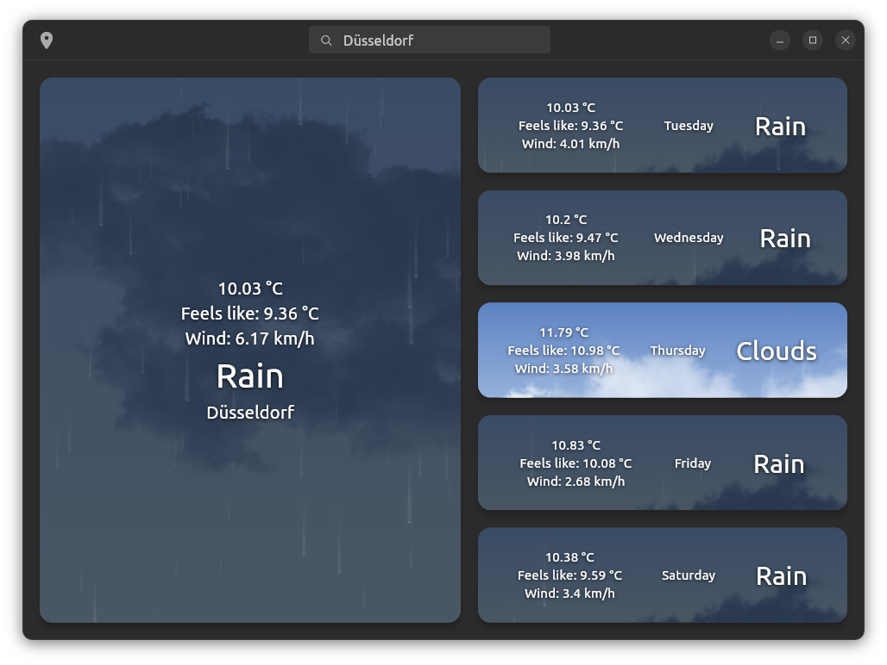
- wizard apps
  

That does not mean there aren't more types of apps and most importantly this should not limit your ideas and creativity in any way.

## Knowledge links and recommended dart libraries
### Freedesktop and other Linux specific API implementations in dart

- [dbus.dart](https://pub.dev/packages/dbus)
- [bluez.dart](https://pub.dev/packages/bluez)
- [nm.dart](https://pub.dev/packages/nm)
- [snapd.dart](https://pub.dev/packages/snapd)
- [xdg_desktop_portal](https://pub.dev/packages/xdg_desktop_portal)
- [desktop_notifications](https://pub.dev/packages/desktop_notifications)

### Essential Flutter knowledge

- [What is State?](https://www.youtube.com/watch?v=QlwiL_yLh6E)
- [BuildContext](https://www.youtube.com/watch?v=rIaaH87z1-g)
### State management

- [provider](https://pub.dev/packages/provider)
- [riverpod](https://pub.dev/packages/riverpod)

### Database access and REST services

- [isar](https://pub.dev/packages/isar)
- [mysql client](https://pub.dev/packages/mysql_client)
- [conduit](https://pub.dev/packages/conduit)

### Cloud API access

- [supabase (open source firebase alternative)](https://pub.dev/packages/supabase)
- [appwrite (oppen source firebase alternative)](https://pub.dev/packages/appwrite)
- [amazon amplify](https://pub.dev/packages/amplify_flutter) (<--- Linux support in dev branch)
- [firebase](https://github.com/invertase/flutterfire_desktop)